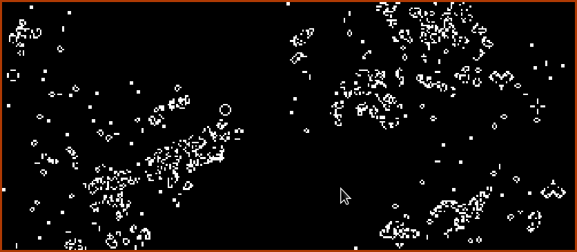

# Pony Game of Life

This is a learning exercice writing Conway's Game of Life in Pony.

## Usage

clone

    git clone https://github.com/xpac27/pony-gameoflife.git
    cd pony-gameoflife
    git submodule update --init

compile

    ponyc

then run the executable

    ./pony-gameoflife

and click to spawn more cells.

## Settings

- Lower `swap_interval` in `Renderer.pony` to speed up the simulation, 1 means synced with monitor's refresh rate
- Change `scale` in `Game.pony` to change the simulation's resolution, higher means smaller (and thus more) cells
